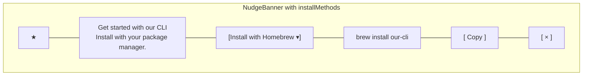
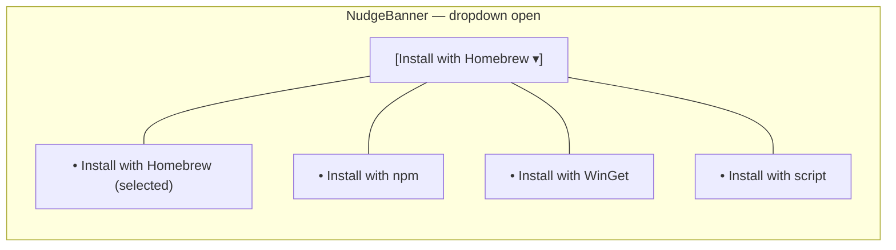
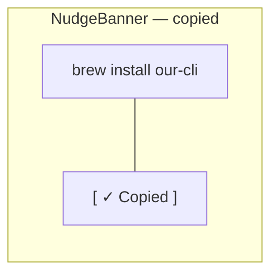

# Mock — the three states of the install-picker variant

These are structural mocks, not pixel-perfect designs. Match the shape and the behavior; don't worry about exact spacing or colors.

## State 1: Dropdown collapsed (default)



```svg
<svg xmlns="http://www.w3.org/2000/svg" viewBox="0 0 760 110" width="760" height="110">
  <rect x="0" y="0" width="760" height="110" fill="#f6f8fa" stroke="#d0d7de" rx="8"/>
  <rect x="16" y="16" width="32" height="32" rx="6" fill="#fff" stroke="#d0d7de"/>
  <text x="32" y="38" font-size="16" text-anchor="middle" fill="#6e40c9">★</text>
  <text x="60" y="32" font-size="14" font-weight="600" fill="#1f2328">Get started with our CLI</text>
  <text x="60" y="50" font-size="12" fill="#57606a">Install with your package manager.</text>
  <rect x="60" y="64" width="180" height="28" rx="6" fill="#fff" stroke="#d0d7de"/>
  <text x="72" y="82" font-size="12" fill="#1f2328">Install with Homebrew</text>
  <text x="226" y="82" font-size="10" fill="#57606a">▾</text>
  <rect x="248" y="64" width="220" height="28" rx="6" fill="#fff" stroke="#d0d7de"/>
  <text x="260" y="82" font-size="12" font-family="monospace" fill="#1f2328">brew install our-cli</text>
  <rect x="476" y="64" width="68" height="28" rx="6" fill="#fff" stroke="#d0d7de"/>
  <text x="510" y="82" font-size="12" text-anchor="middle" fill="#1f2328">Copy</text>
  <text x="720" y="32" font-size="16" fill="#57606a">×</text>
</svg>
```

## State 2: Dropdown open



```svg
<svg xmlns="http://www.w3.org/2000/svg" viewBox="0 0 320 200" width="320" height="200">
  <rect x="0" y="0" width="320" height="200" fill="transparent"/>
  <rect x="0" y="0" width="200" height="28" rx="6" fill="#fff" stroke="#0969da" stroke-width="2"/>
  <text x="12" y="18" font-size="12" fill="#1f2328">Install with Homebrew</text>
  <text x="186" y="18" font-size="10" fill="#57606a">▾</text>
  <rect x="0" y="34" width="220" height="158" rx="8" fill="#fff" stroke="#d0d7de"/>
  <rect x="4" y="38" width="212" height="32" fill="#ddf4ff"/>
  <text x="14" y="58" font-size="12" fill="#1f2328">Install with Homebrew ✓</text>
  <text x="14" y="86" font-size="12" fill="#1f2328">Install with npm</text>
  <text x="14" y="114" font-size="12" fill="#1f2328">Install with WinGet</text>
  <text x="14" y="142" font-size="12" fill="#1f2328">Install with script</text>
</svg>
```

## State 3: "Copied" success (2 seconds, then revert)



```svg
<svg xmlns="http://www.w3.org/2000/svg" viewBox="0 0 340 36" width="340" height="36">
  <rect x="0" y="0" width="220" height="28" rx="6" fill="#fff" stroke="#d0d7de"/>
  <text x="12" y="18" font-size="12" font-family="monospace" fill="#1f2328">brew install our-cli</text>
  <rect x="228" y="0" width="100" height="28" rx="6" fill="#dafbe1" stroke="#1a7f37"/>
  <text x="278" y="18" font-size="12" text-anchor="middle" fill="#1a7f37">✓ Copied</text>
</svg>
```

The "Copied" state should also be announced via `role="status"` so screen readers pick it up.
