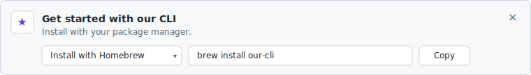
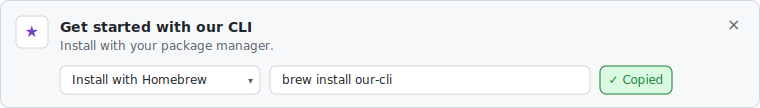
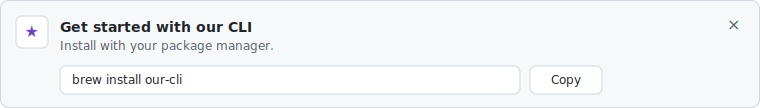

# Mock — the install-picker variant of `NudgeBanner`

Structural mocks, not pixel-perfect designs. Match the **shape** and the **behavior**; don't worry about exact spacing or colors.

The full requirements live in [`TASK.md`](./TASK.md). This file is the visual + interaction reference.

## The states

### 1. Dropdown collapsed (default)

### 2. Dropdown open

### 3. "Copied" success (announced via `role="status"`, reverts after 2 s)

### 4. Single method (`installMethods.length === 1`)

## Schema reminder

`installMethods: Array<{ key: string; label: string; command: string }>`

- `key` — analytics suffix and stable identity (e.g. `homebrew`, `npm`, `winget`, `script`).
- `label` — the **short** name (e.g. `"Homebrew"`, `"npm"`). The component renders `"Install with {label}"` in both the trigger and the menu items.
- `command` — the exact string copied to the clipboard.
